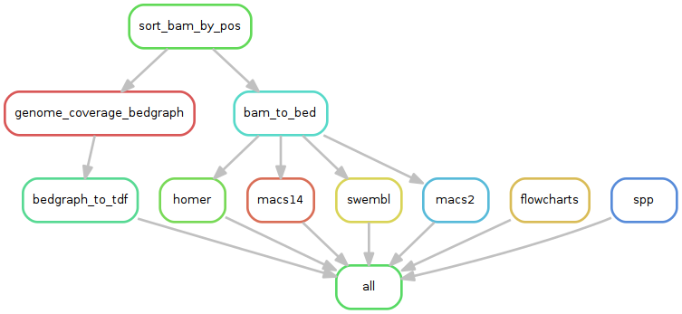
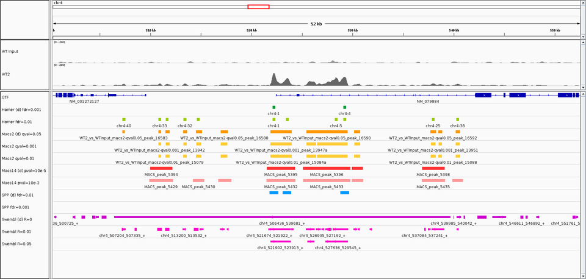

## Schema of a ChIP-seq experiment

1. cross-link DNA with protein (covalent linkage with formaldehyde)
2. DNA fragmentation by sonication
3. immunoprecipitation
4. unlink DNA from protein
5. fragment size selection (typically ~300bp)
6. sequencing

## Typical result

- A hard drive with huge files

    - one or several files per sample (one per run)
    - several 10s of million reads per file
    - read length: typically between 50 and 150bp
    - Sequence format: fastq
    - Quality index associated to each nucleotide of each read

## Example of fastq file

```
@SRR576933.1 HWUSI-EAS1789_0000:2:20:1269:14140/1
AAGCATGGAATAACCGCCTGGTGAATGCTCGCCATA
+
dcd`\dddddaeacecdac`c\cca`bTbbdddYd_
@SRR576933.2 HWUSI-EAS1789_0000:2:20:1270:19579/1
TGGAGGCTGACCACGATAAGCTGCCGCTGGTGGTGC
+
dceYc^\cddd^dddTccc`daYdbdaad`]``XTU
@SRR576933.3 HWUSI-EAS1789_0000:2:20:1270:17351/1
AGTGCGATGCCGTTCACCCGGTTTTCTTTATCATTA
+
dddddc\cc^`c\ccddadcdaadbbc]]]aa^ddT
...
```

## Analysis steps

- **read quality**: checking the quality of the raw short reads
- **read mapping**: aligning the reads against the reference genome, to identify their genomic location
- **peak-calling**: identification of genomic regions that are enriched in reads in immunoprecipitated samples versus background (genomic input, mock, ...)

## Peak-calling comparison workflow




## From reads to peaks




## From reads to peaks


## References
